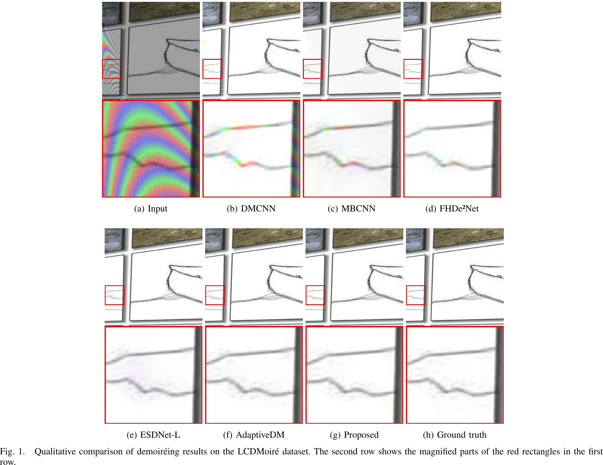
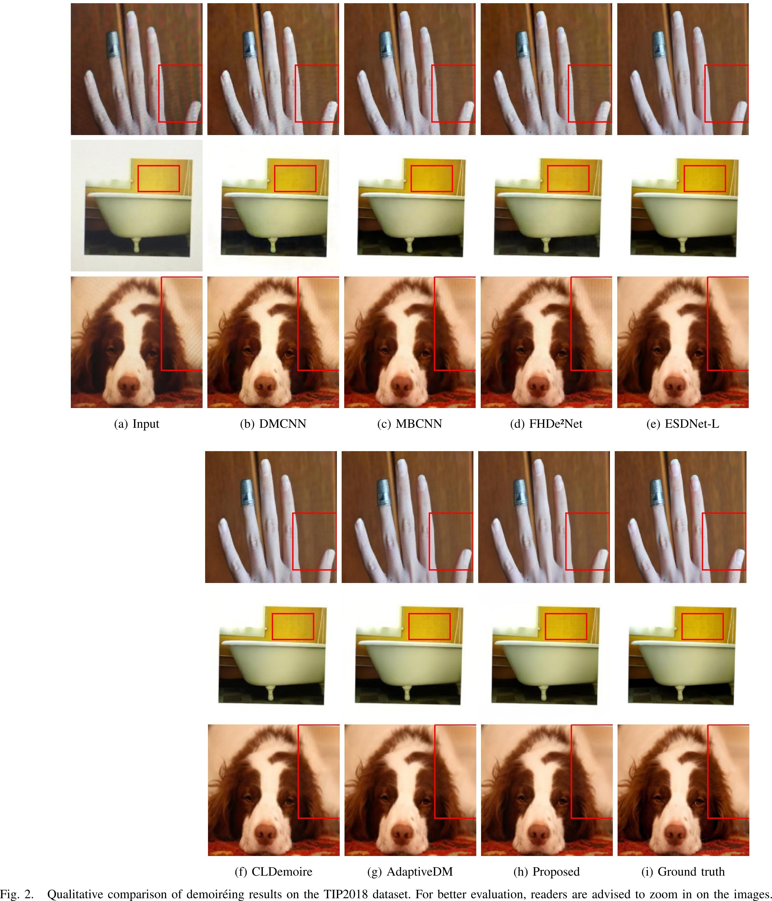

<!-- PROJECT LOGO -->
<br />
<p align="center">
  <!-- <a href="https://nhduong.github.io/">
    
  </a> -->

  <h2 align="center">High-Resolution Screenshot Demoiréing With Auxiliary Negative Sample Generation-Based Contrastive Learning</h2>

  <p align="center">
    <a href="mailto:duongnguyen@mme.dongguk.edu" target="_blank">Duong Hai Nguyen</a><sup>1</sup>,
    <a href="mailto:seholee@jbnu.ac.kr" target="_blank">Se-Ho Lee</a><sup>2</sup>, and 
    <a href="mailto:chullee@dongguk.edu" target="_blank">Chul Lee</a><sup>1,3</sup>
    <br>
    <sup>1</sup>Department of Multimedia Engineering, Dongguk University, South Korea<br>
    <sup>2</sup>Department of Information and Engineering, Jeonbuk National University, South Korea<br>
    <sup>3</sup>Department of Computer Science and Artificial Intelligence, Dongguk University, South Korea
    <br>
    accepted to appear in IEEE Transactions on Circuits and Systems for Video Technology 2026
    <br>
    ·
    <a href="https://doi.org/10.1109/TCSVT.2026.3681919">Paper</a>
    ·
  </p>
</p>

<br>

# Installation
1. Clone this repo:
```bash
git clone https://github.com/nhduong/contrastive-demoire.git
cd contrastive-demoire
```

2. Install dependencies:
```bash
conda create -n ctdm --file requirements.txt
conda activate ctdm
```

3. Download datasets

| Dataset | Download Link |
| :---: | :---: |
| LCDMoiré | Please contact the dataset authors for access |
| TIP2018 | Please contact the dataset authors for access |
| FHDMi | [Google Drive](https://drive.google.com/drive/folders/1IJSeBXepXFpNAvL5OyZ2Y1yu4KPvDxN5) |
| UHDM | [Google Drive](https://drive.google.com/drive/folders/1DyA84UqM7zf3CeoEBNmTi_dJ649x2e7e) |

The directory structure of the datasets should be as follows:
```
data/
├── aim2019_demoireing_track1
│   ├── Training
│   │   ├── clear
│   │   │   └── ... (image files)
│   │   └── moire
│   │       └── ... (image files)
│   └── Validation
│       ├── clear
│       │   └── ... (image files)
│       └── moire
│           └── ... (image files)
├── FHDMi_complete
│   ├── test
│   │   ├── source
│   │   │   └── ... (image files)
│   │   └── target
│   │       └── ... (image files)
│   ├── train
│   │   ├── source
│   │   │   └── ... (image files)
│   │   └── target
│   │       └── ... (image files)
├── TIP-2018
│   ├── testData
│   │   ├── source
│   │   │   └── ... (image files)
│   │   └── target
│   │       └── ... (image files)
│   └── trainData
│       ├── source
│       │   │── ... (image files)
│       └── target
│           │── ... (image files)
└── UHDM_DATA
    ├── test
    │   ├── ..._gt.jpg
    │   ├── ..._moire.jpg
    │   └── ...
    └── train
        ├── pair_00
        │   ├── ..._gt.jpg
        │   ├── ..._moire.jpg
        │   └── ...
        ├── pair_01
        │   ├── ..._gt.jpg
        │   ├── ..._moire.jpg
        │   └── ...
        └── ...
```

# Testing
Replace the following placeholders in the commands below with the appropriate paths:
- `full_path_to_data_directory` is the full path to the directory where the above datasets are located.
- `full_path_to_this_directory` is the full path to the directory where this README.md file is located.
```bash
# for LCDMoiré
CUDA_DEVICE_ORDER="PCI_BUS_ID" CUDA_VISIBLE_DEVICES="0" \
COLUMNS=1024 TORCH_DISTRIBUTED_DEBUG=DETAIL NODE_NAME=$(hostname) \
accelerate launch --config_file ./configs/accelerate_config.yaml --main_process_port 20651 \
main.py ++utils.log2file=false \
    ++models.main.shuffle_num=2 ++opt.epochs=200 ++opt.T_0=50 ++data.train.patch_size=512 ++utils.eval.name="aim" \
    ++data.name="aim" ++data.path="full_path_to_data_directory/aim2019_demoireing_track1" ++data.moire_dir="moire" ++data.clean_dir="clear" ++data.train.path="Training" ++data.val.path="Validation" \
    ++exp.resume="full_path_to_this_directory/cp/aim" ++exp.evaluate_epochs=[196] ++exp.evaluate=true

# for TIP2018
CUDA_DEVICE_ORDER="PCI_BUS_ID" CUDA_VISIBLE_DEVICES="0" \
COLUMNS=1024 TORCH_DISTRIBUTED_DEBUG=DETAIL NODE_NAME=$(hostname) \
accelerate launch --config_file ./configs/accelerate_config.yaml --main_process_port 20651 \
main.py ++utils.log2file=false \
    ++models.main.shuffle_num=2 ++opt.epochs=60 ++opt.T_0=10 ++utils.eval.name="tip18" \
    ++data.name="tip18" ++data.path="full_path_to_data_directory/TIP-2018" ++data.moire_dir="source" ++data.clean_dir="target" ++data.train.path="trainData" ++data.val.path="testData" \
    ++exp.resume="full_path_to_this_directory/cp/tip18" ++exp.evaluate_epochs=[59] ++exp.evaluate=true

# for FHDMi
CUDA_DEVICE_ORDER="PCI_BUS_ID" CUDA_VISIBLE_DEVICES="0" \
COLUMNS=1024 TORCH_DISTRIBUTED_DEBUG=DETAIL NODE_NAME=$(hostname) \
accelerate launch --config_file ./configs/accelerate_config.yaml --main_process_port 20651 \
main.py ++utils.log2file=false \
    ++opt.epochs=100 ++opt.T_0=50 ++data.train.patch_size=1024 ++utils.eval.name="fhdmi" \
    ++data.name="fhdmi" ++data.path="full_path_to_data_directory/FHDMi_complete" ++data.moire_dir="source" ++data.clean_dir="target" ++data.train.path="train" ++data.val.path="test" \
    ++exp.resume="full_path_to_this_directory/cp/fhdmi" ++exp.evaluate_epochs=[95] ++exp.evaluate=true

# for UHDM
CUDA_DEVICE_ORDER="PCI_BUS_ID" CUDA_VISIBLE_DEVICES="0" \
COLUMNS=1024 TORCH_DISTRIBUTED_DEBUG=DETAIL NODE_NAME=$(hostname) \
accelerate launch --config_file ./configs/accelerate_config.yaml --main_process_port 20651 \
main.py ++utils.log2file=false \
    ++opt.epochs=150 ++opt.T_0=50 ++data.train.patch_size=1536 ++utils.eval.name="uhdm" \
    ++data.name="uhdm" ++data.path="full_path_to_data_directory/UHDM_DATA" \
    ++exp.resume="full_path_to_this_directory/cp/uhdm" ++exp.evaluate_epochs=[145] ++exp.evaluate=true
```

# Training
Note that, by default, training logs will be saved in log files. To show logs in the terminal, set `++utils.log2file=false` in the commands below.
```bash
# for LCDMoiré
CUDA_DEVICE_ORDER="PCI_BUS_ID" CUDA_VISIBLE_DEVICES="0" \
COLUMNS=1024 TORCH_DISTRIBUTED_DEBUG=DETAIL NODE_NAME=$(hostname) \
accelerate launch --config_file ./configs/accelerate_config.yaml --main_process_port 20651 \
main.py ++utils.log2file=true \
    ++models.main.shuffle_num=2 ++opt.epochs=200 ++opt.T_0=50 ++data.train.patch_size=512 ++utils.eval.name="aim" \
    ++data.name="aim" ++data.path="full_path_to_data_directory/aim2019_demoireing_track1" ++data.moire_dir="moire" ++data.clean_dir="clear" ++data.train.path="Training" ++data.val.path="Validation"

# for TIP2018
CUDA_DEVICE_ORDER="PCI_BUS_ID" CUDA_VISIBLE_DEVICES="0" \
COLUMNS=1024 TORCH_DISTRIBUTED_DEBUG=DETAIL NODE_NAME=$(hostname) \
accelerate launch --config_file ./configs/accelerate_config.yaml --main_process_port 20651 \
main.py ++utils.log2file=true \
    ++models.main.shuffle_num=2 ++opt.epochs=60 ++opt.T_0=10 ++utils.eval.name="tip18" \
    ++data.name="tip18" ++data.path="full_path_to_data_directory/TIP-2018" ++data.moire_dir="source" ++data.clean_dir="target" ++data.train.path="trainData" ++data.val.path="testData"

# for FHDMi
CUDA_DEVICE_ORDER="PCI_BUS_ID" CUDA_VISIBLE_DEVICES="0" \
COLUMNS=1024 TORCH_DISTRIBUTED_DEBUG=DETAIL NODE_NAME=$(hostname) \
accelerate launch --config_file ./configs/accelerate_config.yaml --main_process_port 20651 \
main.py ++utils.log2file=true \
    ++opt.epochs=100 ++opt.T_0=50 ++data.train.patch_size=1024 ++utils.eval.name="fhdmi" \
    ++data.name="fhdmi" ++data.path="full_path_to_data_directory/FHDMi_complete" ++data.moire_dir="source" ++data.clean_dir="target" ++data.train.path="train" ++data.val.path="test"

# for UHDM
CUDA_DEVICE_ORDER="PCI_BUS_ID" CUDA_VISIBLE_DEVICES="0" \
COLUMNS=1024 TORCH_DISTRIBUTED_DEBUG=DETAIL NODE_NAME=$(hostname) \
accelerate launch --config_file ./configs/accelerate_config.yaml --main_process_port 20651 \
main.py ++utils.log2file=true \
    ++opt.epochs=150 ++opt.T_0=50 ++data.train.patch_size=1536 ++utils.eval.name="uhdm" \
    ++data.name="uhdm" ++data.path="full_path_to_data_directory/UHDM_DATA"
```

Training logs and checkpoints will be saved in `./outputs/` by default. You can change this path in `configs/hydra_config.yaml` by modifying the `hydra.run.dir` field. To inspect training/validation logs, use TensorBoard
```bash
tensorboard --logdir="./outputs" --port=port_number
```
or monitor log files directly
```bash
tail -f ./outputs/ladybugs/data-name/log-name/outputs/log-filename.log
```

# Supplementary Qualitative Results
<div style="display: flex; justify-content: center;">
  
</div>

<br> <br>

<div style="display: flex; justify-content: center;">
  
</div>

<br>

# Citation
If you find this work useful for your research, please cite our paper:
```
@article{2026_nguyen_ctdm,
  author  = {Nguyen, Duong Hai and Lee, Se-Ho and Lee, Chul},
  title   = {High-Resolution Screenshot Demoiréing with Auxiliary Negative Sample Generation-Based Contrastive Learning},
  journal = {IEEE Transactions on Circuits and Systems for Video Technology},
  month   = apr,
  year    = {2026},
  doi     = {10.1109/TCSVT.2026.3681919}
}
```

The code is released under the MIT license. See [LICENSE](https://choosealicense.com/licenses/mit/) for additional details.

# Acknowledgements
This code is built on [UHDM](https://github.com/CVMI-Lab/UHDM).